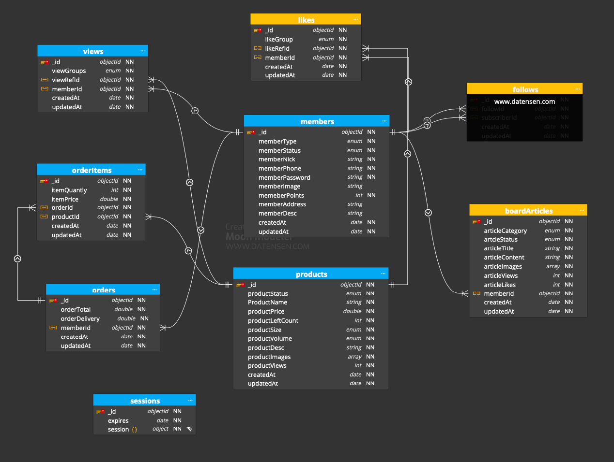
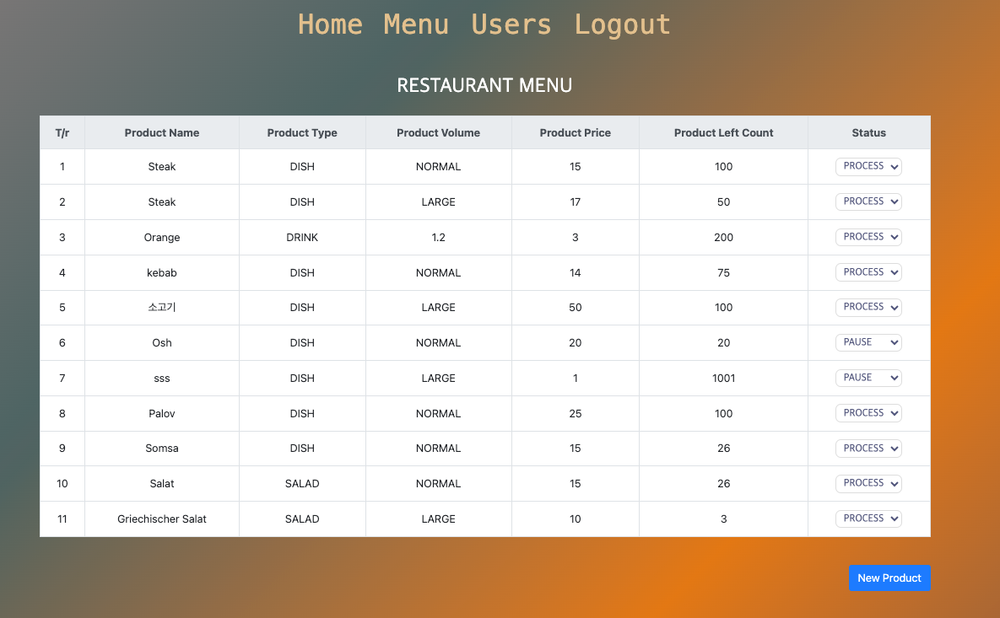

# Chusty Project Backend

Chusty 프로젝트의 백엔드 서버 저장소입니다. 향후 구현될 프론트엔드 어플리케이션(SPA)과 통신하는 REST API 서버 역할을 하며, 내부 관리자를 위한 서버사이드 렌더링(SSR) 기반의 관리자 웹 페이지를 포함하고 있습니다. 식당 배달/주문 비즈니스를 모델링하여 개발되었습니다.

## Key Features (주요 기능)

이 프로젝트는 크게 **일반 사용자를 위한 B2C API**와 **레스토랑 관리자를 위한 B2B 백오피스**로 나뉘어 설계되었습니다.

* **B2C 클라이언트 API (`/` 라우터)**
  * **회원 관리:** 로그인, 회원가입, 내 정보 수정 및 상위 랭킹 유저 조회
  * **상품 및 주문:** 레스토랑의 메뉴(상품) 조회, 상품 주문(Order) 생성 및 내 주문 내역 조회/상태 업데이트
* **B2B 관리자 대시보드 (`/admin` 라우터)**
  * **레스토랑 권한 관리:** 레스토랑 관리자 전용 회원가입 및 로그인 세션 처리
  * **메뉴(상품) 관리:** 새로운 메뉴 등록 (Multer를 이용한 이미지 다중 업로드 지원), 메뉴 정보 수정
  * **유저 관리:** 가입된 전체 사용자 목록 조회 및 회원 상태 수정
* **실시간 통신 트래킹**
  * `Socket.io`를 활용하여 실시간으로 서버에 접속 중인 클라이언트의 연결 상태와 총 접속자 수를 트래킹

## Tech Stack

* **Runtime & Language**: Node.js, TypeScript
* **Framework**: Express.js
* **Database**: MongoDB (Mongoose ORM)
* **Real-time**: Socket.io
* **View Engine**: EJS (Admin 전용 SSR)
* **Authentication & Upload**: express-session, connect-mongodb-session, Multer

## Architecture & Design Decisions

### 1. 이원화된 라우팅 설계
하나의 Express 서버 안에서 목적에 따라 라우팅과 응답 방식을 완벽히 분리했습니다.
* **REST API (`router.ts`)**: JSON을 반환하여 React/Vue 등 모던 프론트엔드 프레임워크와 결합하도록 설계.
* **SSR (`router-admin.ts`)**: EJS 템플릿 엔진을 사용해 관리자 페이지를 서버에서 직접 렌더링하여, 백오피스를 빠르고 독립적으로 구축.

### 2. Controller - Service 계층 분리
비즈니스 로직의 복잡도가 증가함에 따라 라우터와 모델이 강하게 결합되는 것을 막기 위해 `Service` 레이어를 도입했습니다.
* **Controller**: HTTP 요청(Request)을 받아 검증하고, 클라이언트에게 응답(Response)을 반환하는 역할에 집중합니다.
* **Service**: 데이터베이스 통신 및 핵심 비즈니스 로직(`Auth.service`, `Product.service`, `Order.service` 등)을 전담하여 코드 재사용성과 테스트 용이성을 높였습니다.

### 3. Session 기반 인증
보안과 확장성을 위해 `express-session`과 `connect-mongodb-session`을 결합하여 사용했습니다. 로그인된 사용자의 세션 정보는 MongoDB에 안전하게 저장되며 서버 재시작 시에도 유지됩니다.

```text
src/
├── controllers/    # HTTP 요청/응답 처리
├── services/       # (models 폴더 내) 비즈니스 로직 및 DB 접근 처리
├── schema/         # Mongoose 데이터베이스 스키마
├── libs/           # 공통 타입(types), 업로더 유틸리티(uploader) 등
├── public/         # 정적 자산(CSS, JS, 폰트 등)
├── views/          # EJS 관리자 페이지 템플릿
├── app.ts          # 미들웨어 및 서버 기본 설정
└── server.ts       # 데이터베이스 연결 및 포트 리스닝
```

## Database ER Modeling

프로젝트에 사용된 주요 데이터베이스의 ER(Entity-Relationship) 모델링입니다.



## Admin Page

레스토랑 관리자가 메뉴를 등록하고 유저를 관리할 수 있는 어드민 인터페이스입니다.



## Getting Started

프로젝트를 로컬 환경에서 실행하기 위한 방법입니다.

### 1. 의존성 패키지 설치
```bash
npm install
```

### 2. 환경 변수 설정
프로젝트 루트 디렉토리에 `.env` 파일을 생성하고 아래와 같은 형태로 설정값을 입력해야 합니다.
```env
PORT=3003
MONGO_URL=your_mongodb_connection_string
SESSION_SECRET=your_session_secret_key
```

### 3. 서버 실행
개발 환경(Development) 모드로 서버를 실행합니다.
```bash
npm run start:dev
```
서버가 성공적으로 실행되면 `http://localhost:3003/admin` 을 통해 관리자 페이지에 접근할 수 있습니다.
